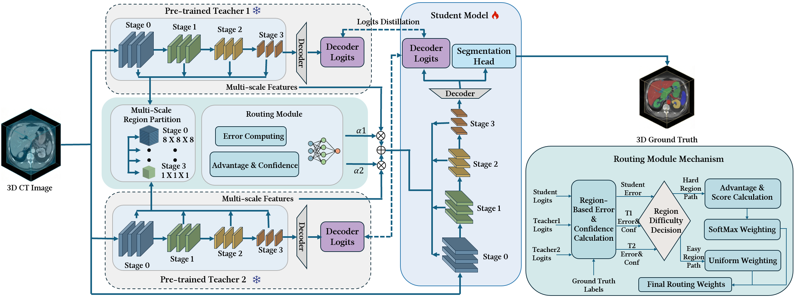

# TPR_MultiTeacher

**TPR** (Task-Performance-based Routing for multi-teacher): multi-teacher knowledge distillation for 3D medical image segmentation. The student and teachers share the **same network architecture** (SwinUNETR). The student learns from two frozen teachers via task-performance-based routing—dynamically selecting or blending teachers per region.

## Method Overview



TPR routes knowledge from two frozen teachers to a single student with the same architecture:

- **Task-Performance routing**: Routing weights are computed from region-wise prediction errors against ground truth.
- **Hard/easy adaptation**: Hard regions use a softmax over teacher relative advantages; easy regions use uniform teacher weights.
- **Hierarchical routing**: Encoder stages use fixed grids (`8x8x8`, `4x4x4`, `2x2x2`, `1x1x1`) to match boundary-level and semantic-level features.
- **Losses**: Supervised segmentation, region-weighted feature alignment, region-averaged logits distillation, and an entropy-based load-balance term.

The student is warm-started from one teacher's weights and trained with mixed-precision and optional EMA for validation.

---

## Requirements

- Python 3.8+
- PyTorch (with CUDA for GPU training)
- [MONAI](https://monai.io/)
- SwinUNETR-compatible environment (e.g. `monai.networks.nets.SwinUNETR`)

Data and checkpoints:

- A 3D segmentation dataset with a `dataset.json` that has `training` (and optionally `validation`) splits (e.g. MSD Pancreas, or similar structure).
- Two pre-trained teacher checkpoints (e.g. SuPreM and VoCo/CLIP-driven), each with a compatible SwinUNETR architecture (`feature_size=48`).

---

## Project Structure

```
TPR_MultiTeacher/
├── README.md
├── main.png                 # Method figure
├── train_tpr.py             # Training entry
├── train_tpr.sh             # Example training script
├── dataset_pancreas.py      # Dataset loader (Pancreas or similar)
├── eval_metrics.py         # Dice / metrics used during validation
├── utils.py
├── model/
│   ├── __init__.py
│   ├── student.py           # Student (same SwinUNETR as teacher)
│   ├── teachers.py          # Load two frozen teachers (full model + decoder)
│   └── tpr_routing.py       # TPR routing and feature mixing
└── loss/
    ├── __init__.py
    └── tpr_loss.py          # Segmentation, alignment, logits, balance
```

---

## Installation

1. Clone the repository (or extract the anonymous code package).
2. Create a virtual/conda environment and install dependencies, for example:

```bash
pip install torch torchvision  # match your CUDA version
pip install monai
# Install any other project-specific deps (e.g. nibabel, tqdm)
```

3. Prepare your dataset and teacher checkpoints (see below).

---

## Training

1. Set paths in `train_tpr.sh` (or pass them on the command line):
   - `--data-dir`: root directory of your dataset (containing `dataset.json`).
   - `--teacher-1-path`, `--teacher-2-path`: paths to the two teacher `best_model.pth` (or equivalent).
   - Adjust `--num-classes`, `--roi-size`, `--batch-size`, etc. as needed.

2. Run training:

```bash
bash train_tpr.sh
```

Or call the script directly:

```bash
python train_tpr.py \
  --data-dir /path/to/your/dataset \
  --teacher-1-path /path/to/teacher1/best_model.pth \
  --teacher-2-path /path/to/teacher2/best_model.pth \
  --save-dir ./checkpoints_tpr \
  --num-classes 3 \
  --epochs 1000 \
  --val-interval 10
```

Checkpoints are saved under `--save-dir` with a timestamped subfolder. Best model is saved as `best_model.pth` (includes `student_state_dict`, `tpr_state_dict`, optimizer, scaler, and optional EMA). To resume:

```bash
python train_tpr.py ... --resume /path/to/checkpoints_tpr_YYYYMMDD_HHMMSS/best_model.pth
```

Validation runs during training (see `--val-interval`). Metrics and best Dice are logged in `training_history.json` and in the checkpoint directory.

---

## Main Hyperparameters

| Argument | Default | Description |
|----------|---------|-------------|
| `--data-dir` | `/path/to/your/dataset` | Dataset root |
| `--teacher-1-path` / `--teacher-2-path` | - | Teacher checkpoints |
| `--num-classes` | 3 | Number of classes (incl. background) |
| `--roi-size` | 96 96 96 | Training/inference ROI |
| `--hard-region-threshold` | 0.5 | Threshold for “hard” regions in routing |
| `--routing-temperature` | 0.7 | Softmax temperature for routing weights |
| `--lambda-seg` | 1.0 | Segmentation loss weight |
| `--lambda-align` | 0.2 | Feature alignment weight |
| `--lambda-logits` | 0.2 | Logits distillation weight |
| `--lambda-balance` | 0.1 | Load-balance loss weight |
| `--distill-stop-epoch` | 1200 | Epoch after which distillation/align/balance are turned off |
| `--save-dir` | `./checkpoints_tpr` | Checkpoint directory |

---

## License

This project is released for anonymous review. See the submission package for any license or citation instructions.
